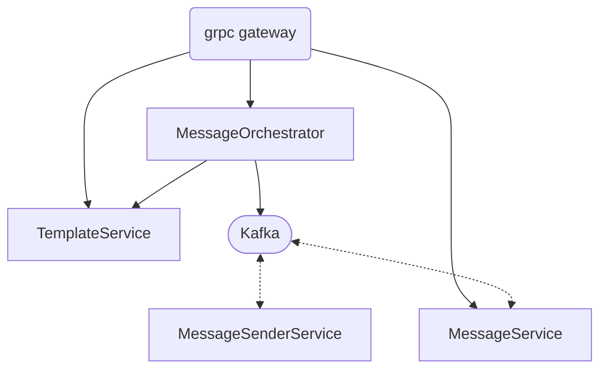

# Messaging platform

This repository contains the training material for the Messaging Platform.
The platform handles the messages sending to the users. It is overcomplicated for the sake of the training.

## Overview

The platform is composed of the following components:
1. **API Gateway**: The entry point of the platform. It is responsible for routing the requests to the appropriate services.
2. **Message Orchestrator**: The service responsible for orchestrating the messages sending. It is responsible for the following:
    - Enriching the message requests with the template.
    - Sending the message requests to the appropriate message sender.
    - Sending the message requests to service responsible for persisting the messages.
3. **Message Sender**: The service responsible for sending the messages to the users. It is responsible for the following:
    - Sending the message to the user.
    - Handling the message sending errors.
    - Sending the message sending status.
4. **Message Service**: The service responsible for persisting the messages. It is responsible for the following:
    - Persisting the message requests.
    - Handling the message persistence errors.
    - Persisting message status updates
5. **Message Template Service**: The service responsible for managing the message templates. It is responsible for the following:
    - Managing the message templates.

## Current Design

## Setup
### Hint how to install protoc
`go install google.golang.org/grpc/cmd/protoc-gen-go-grpc@v1.2`  
`go install google.golang.org/protobuf/cmd/protoc-gen-go@v1.28`  
`PB_REL="https://github.com/protocolbuffers/protobuf/releases"`  
`curl -LO $PB_REL/download/v25.1/protoc-25.1-linux-x86_64.zip`  
`unzip protoc-3.26.0-linux-x86_64.zip -d protoc3`  
`sudo mv protoc3/bin/* /usr/local/bin/`  
`sudo mv protoc3/include/* /usr/local/include/` 

### Hint how to install grpc gateway generator
`go install github.com/grpc-ecosystem/grpc-gateway/v2/protoc-gen-grpc-gateway@latest`  
`go install github.com/grpc-ecosystem/grpc-gateway/v2/protoc-gen-openapiv2@latest`  
`go install google.golang.org/grpc/cmd/protoc-gen-go-grpc@latest`  
`go install google.golang.org/protobuf/cmd/protoc-gen-go@latest`  
or use  
`make tools`
